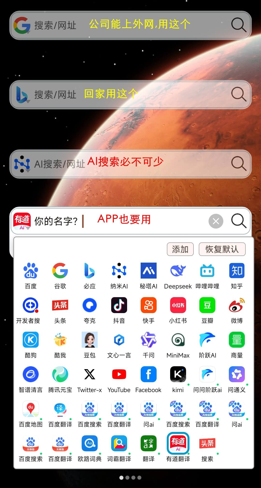
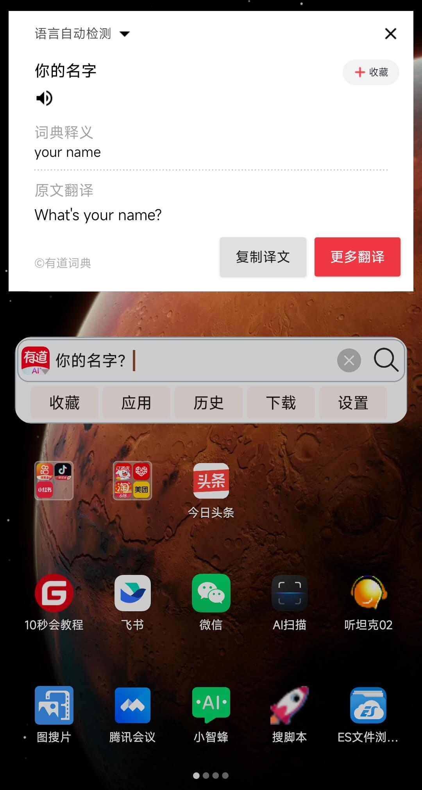
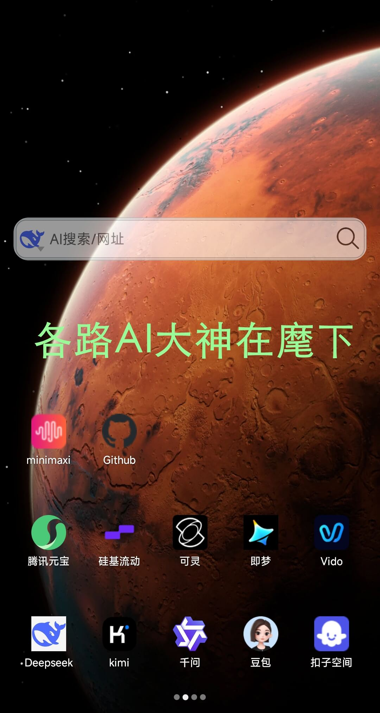
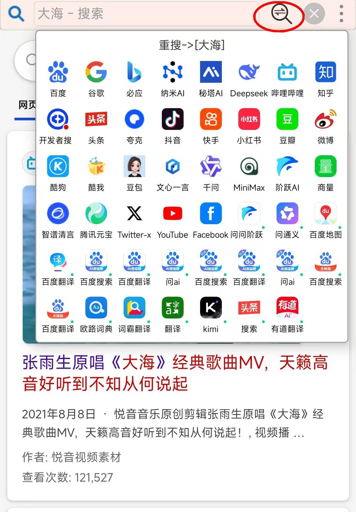
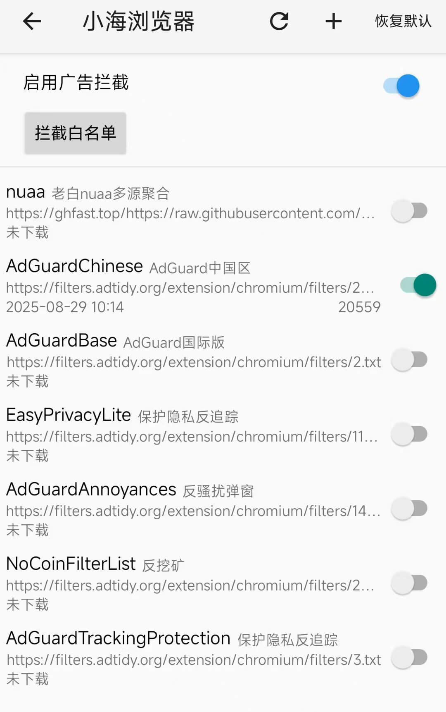
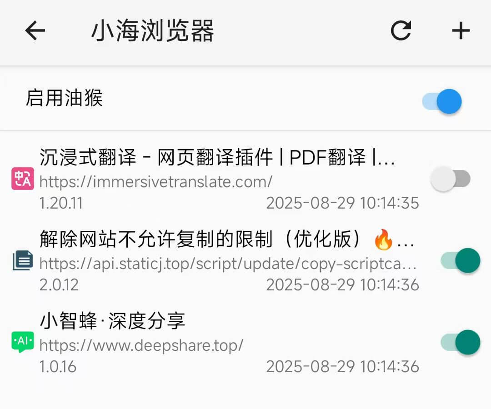

#  小海浏览器使用指南


###  **小海浏览器:每次节省3秒生命**

https://www.dahai123.top/ 官网
* 常见app使用中各种等待/植入广告,每次都能浪费你3~5秒生命;
* 小海浏览器能毫秒启动无广告3M大,能用40多个AI/搜索;节省生命,提高效率

 **请升级到2.2.9版以上,设置->检查更新;APP备案变更中,可能有些应用市场暂时搜不到**


## **10秒会新手教程:**


### 1. 效率神器--搜索/AI/APP无缝切换,直达搜索结果,拒绝推荐,拒绝注意力劫持

可用常见40多个AI/搜索,可调用其他APP(绿点图标),比如翻译.

**长按图标**,弹出下拉框. **粗线框**是默认选中,**细线框**是同时搜索,同时查看多个搜索引擎的结果. 

多个搜索自由切换,包括deepseek, 避免安装/切换40多个app , 几乎涵盖国内常见搜索.
添加搜索框:**长按桌面-**>微件->小海浏览器,可见两种搜索框,拖到桌面,可以添加数个搜索框,满足多种搜索需求;

<div align="left"></div>
<div align="left"></div>
<div align="left"></div>

------


### 2. 快速切换搜索/AI/APP,获得更满意的答案

<div align="left"></div>


------


### 3.桌面与浏览器合一

默认桌面上划都是网页

1.1用户设置中可选左侧上划是网页,桌面右侧上划是收藏夹;点击网页底部**房子图标**退回桌面;空白页面下滑能回到桌面;

1.2 适配全面屏手势,网页区域更大(手机有全面屏手势/经典导航键,两种系统导航方式):

<div align="left"></div>

------


### 4. 打造个性和效率为中心的桌面

桌面管理/屏幕导航/个性头像
**点击左/右侧边**弹出屏幕导航,方便多屏幕快速切换,可给屏幕设置不同的图标/文字/颜色

<div align="left"></div>


------


### 5.桌面可添app/微件/网站/文件夹--比传统桌面更强大

添加搜索框:**长按桌面->微件**,可添加其他微件,比如加入**哔哩哔哩,夸克的微件**

app/文件夹/网站可加到不同的屏幕,**支持文件夹合并**,同时打开文件夹内所有网站

<div align="left"></div>


------

### 6 超高速广告拦截--告别弹窗,告别愤怒,世界清净了

不光自己没有植入广告,还自带超高速广告拦截器,反钓鱼挖矿等恶意脚本,

 

<div align="left"></div>


### 7.支持油猴脚本--解锁各种作弊神器


**小智蜂AI分享插件**: 默认安装,专门解决数千字AI问答发给朋友,导致其手机被刷屏,不方便阅读的问题.**免登录就能使用**. 

https://www.deepshare.top/  


**沉浸式翻译**:外文网站,页面右上角三点->启动翻译,仅在当前页面启动翻译.点粉红钮或四指触屏,开始翻译;页面右下角三横->油猴脚本是所有网页默认启动脚本.

------


### 8.图搜片--专门解决影视解说不留片名问题

[图搜片:以图和台词搜影视剧](https://gitee.com/boomer001/dahai-browser/blob/master/tusopiam.md),(点击详情),能自由截图发给图片搜索引擎搜索, 还能识别图片中的文字, 

点**放大镜**,同时发给搜索引擎搜索,快速查找影视剧名,专门解决影视解说不留名的问题.

当然,识别花草树木动植物也是可以的.

<div align="left"></div>


------


### 9.横向滑动验证码,可使用两指滑动

横向滑动手势与网页内横向滚动冲突(滑动验证码), 可使用两指滑动,或右上三点菜单键关闭本页手势


 <div align="left"></div>

------


###  10. 开通vip所有功能不限


app没有任何广告,不收集隐私,VIP优惠期,一年6.6元;两年9.9元(娃哈哈哈~~,你笑了没?)


成为VIP用户:桌面点**'收藏'**->点'账号',或网页界面,点右下角三横,点账号;不成为VIP也能正常使用

<div align="left"></div>
<div align="left"></div>


******


------

[小海浏览器官网](https://www.dahai123.top/)
<!--[使用技巧](http://gitee.com/boomer001/dahai-browser/blob/master/skill.md#%E5%A4%A7%E6%B5%B7%E6%B5%8F%E8%A7%88%E5%99%A8%E4%BD%BF%E7%94%A8%E6%8A%80%E5%B7%A7)-->
[更新日志](http://gitee.com/boomer001/dahai-browser/blob/master/changelog.md)


 

******

## **正文**:


小海浏览器是一款android手机桌面&浏览器

>    ●0.2秒启动无广告
>
>    ●桌面上划是网页
>
>    ●屏幕导航:多屏风格个性头像
>
>    ●图搜片:用图片台词搜影视剧
>
>    ●40多个搜索/AI/APP自由切换
>
>    ●多桌面/搜索框/微件/文件夹
>
>    ●支持油猴脚本,解锁各种作弊神器
>
>    ●不收集窥探个人隐私
>
>    ●速度快省流量,防劫持更安全
>
>    ●简单/直接/方便/小,apk仅3M

华为mate30 253ms启动; 2021年的红米11pro, 330ms启动; 2019年的米8se, 500ms启动
仅支持android8以上手机

*****

## 1. 默认桌面上划都是网页

启动后进入桌面,上划进入网页界面.可设置左侧上划网页,右侧上划收藏夹

若设置右侧上划进入收藏夹界面,内有收藏夹/应用/历史/下载/设置等内容

左侧上划进入网页界面, 中间区域不响应,防止误操作

进入2, 3 界面后,不在区分左右上划,下划回到桌面1


*****

## 2. '米'字手势操作(水平/垂直/45°,仅用一个拇指,解放双手,默认不开启)

- 点击网页底部**房子图标**退回桌面

### 2.2、水平滑动->页面切换(since:1.2.6)

- **单指**水平滑动,前个网页/下个网页,比如当前网页5,变成网页4或6
- **双指**水平滑动,仅页面内的横向滚动
- **本页关闭手势**网页界面,右上角三点菜单->关闭本页手势

### 2.3、(拇指伸直舒服)45°斜下划↘或↙ -->关闭当前网页(since:1.2.6)

### 2.4、45°斜上划↖或↗ -->恢复刚关闭的网页(since:1.2.9)

### 2.5、设置->网页手势设置,可以关闭45°斜上下划(since:1.2.23)
- **    左斜下(↘)关闭网页,右斜上(↖)恢复已关网页,是一组
- **    右斜下(↙)关闭网页,左斜上(↗)恢复已关网页,是一组
- 比如有人左手大拇指容易误操作↘或↖,可以将之关闭,只用↙或↗,关闭或重开网页;
*****

## 3. 多搜索框独立设置(since:1.4.0)

> 1.长按桌面->微件->小海浏览器,可见两种搜索框,拖到桌面,可以添加数个搜索框,满足多种搜索需求
<div align="left"></div>

> 2. 可以切换/拖动/编辑多个不同搜索引擎,可以自添加搜索引擎

<div align="left"></div>

> 3.可同时访问多个AI搜索,一次获得更全面的结果;可用40多个AI/搜索,避免安装20多个app
    <div align="left"></div>
> 4. 一键切换搜索引擎,重搜
<div align="left"></div>


> 5. 点击输入框,上方是剪贴板的url,下方是历史搜索记录;长按历史搜索记录是删除,点击清空是清除所有搜索记录
<div align="left"></div>

> 6. 搜索框输入文字,上方是与文字相关的收藏夹/历史中的网址,下方初始搜索历史,点击搜索,长按删除搜索历史;输入后显示搜索建议,点击搜索

<div align="left"></div>

****


## 4. 第二桌面

**支持多桌面,桌面可添加app快捷/微件/网页快捷/合并文件夹**

<div align="left"></div>

>
桌面第一屏连续右滑退出app

桌面仅放几个常用的app快捷,常访问的网站

两个文件夹也能合并为一个, 4宫格/9宫格自动切换

app快捷一键返回,比如一键返回微信,名称能编辑

可以添加天气等微件

可以添加网页快捷到桌面, 名称能编辑

文件夹容量可以设置, 目前最大81

<div align="left"></div>

>

一键打开文件夹内所有网页

将常看网页放到一个文件夹内,一次打开全部.(文件夹内app只能打开最后一个,android系统的限制)

<div align="left"></div>

*****

## 5. 网页浏览,自动拦截apk打开/下载的弹出框

> 1 **自动拦截下载app**：
打开百度/bilibili等网站,会不断弹出定位/用app打开/下载app的弹框,小海浏览器会自动拦截;
确实需要下载app,左上三点菜单->允许打开app

>  2 **一键静音**：
  多个网页有音视频播放,可一键静音,比如打开多个bilibili网页视频自动播放,太乱了,可一键静音


>  3 **同页再开**：
    就是复制标签,相同的网址再开新的网页,比如测试的时候, 需要当前的网页,又需要相同的网页改动点东西,对比看看不同

>  4 **恢复已关**：
  默认每次打开3个最近关闭的网页

>  5 **多网页缩略图概览**：
  点击右下角数字框,会弹出多网页缩略图概览,可迅速切换网页,一键关闭左右侧网页,十分方便
<div align="left"></div>


*****


## 6 超高速广告拦截

不光自己没有植入广告,还自带超高速广告拦截器,反钓鱼挖矿等恶意脚本,16万条拦截规则.有些浏览器超1万拦截规则就卡顿了

<div align="left"></div>


```
无图模式
无图模式有2种,随着流量增大,很多时候用不到
 1 **全局无图**：任何网页都无图, 废弃,几乎用不到(暂隐藏,用不到了)
 2 **此网站无图**: 网页所在的网站无图, 这网站的网页都无图浏览, 可以编辑网址保存
 3 **仅本页有图**: 网页无图后, 临时看看页面的图片
过去无图模式可以节约流量,
而现在有些网页不断跳图(含弹窗广告),遮挡文字,影响阅读. 无图后,图片区域是透明的,不再遮挡
```


****

## 7. 不收集窥探个人隐私
不收集窥探个人隐私

只请求一个存储权限,因为有下载功能

为了显示读取应用列表,不保存,不上传到网络

不获取用户手机设备信息(IMEI、OAID、IMSI、MAC等信息).

仅使用腾讯X浏览器内核,腾讯bugly收集崩溃日志,再无其他第三方SDK,不会被其他第三方SDK收集个人信息

应用市场里随便一个APP,索要的权限,收集的用户信息,都比小海浏览器多

****

## 8. 锁定/解锁屏幕(since:1.2.18)

	桌面长按弹出菜单,锁定屏幕后,桌面图标不能移动;
<div align="left"></div>

****


## 9.支持油猴脚本,双语对照翻译(since:1.5.0)


    2. 支持油猴脚本

<div align="left"></div>


****

##  10 图搜片

(sine:2.0.0)

起因:刷影视剧解说的短视频,其故意不告诉片名,去评论区也找不到,遂解决这个痛点.

图搜片:集成图片和台词搜索,搜索影视剧/短视频等各种视频;帮助检查视频是否被搬运侵权盗播;发现不同平台的视频分身;

点击'图搜片',选择图片;或者**截截图后,发送**给小海浏览器,直接进入图搜片

右下角 A 是文字识别; 点发大镜, 把白框发送给搜索引擎; 如果有台词,同时进行台词搜索

<div align="left"></div>


## 账号/捐助

> 普通用户/收费用户都没有广告
> vip功能介绍
详见 app中: 设置->账号/捐助


****


## 官网

**小海浏览器官网**

[http://www.dahai123.top/](http://www.dahai123.top/)

小海浏览器官方版下载|123pan

[http://www.123pan.com/s/Wa9bVv-ohQrh.html](http://www.123pan.com/s/Wa9bVv-ohQrh.html)

[旧版app合集 http://www.123pan.com/s/Wa9bVv-waQrh.html](http://www.123pan.com/s/Wa9bVv-waQrh.html)

## 国内应用市场对个人APP开发者友好度评测

记录一下自己上架的经历:

http://gitee.com/boomer001/dahai-browser/blob/master/app-market-evaluate.md

